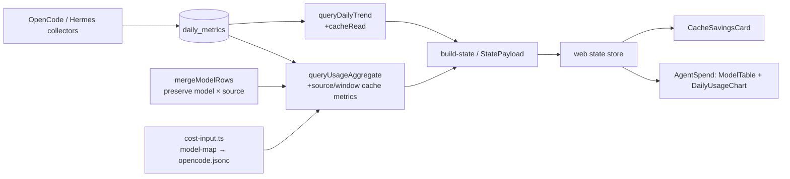

## Context

`daily_metrics` already records cache reads for both collectors; the dashboard aggregation and state-building path currently omit them (see `proposal.md` and tasks 1.1–3.2). This design adds cache metrics without changing collector contracts, existing token semantics, or existing API members.

### Architecture overview



The additive surface is `cacheReadTokens` at daily, window, source, and model levels; `cacheHitRate` at window, source, and model levels; and `cacheSavings` at window, source, and model levels. `CacheSavingsCard` receives precomputed values only: rate lookup is server-only.

### Data flow

1. Existing collectors persist cache-read counts unchanged. `queryDailyTrend` projects a separate `cacheRead` series; the existing five-term `tokens` sum remains unchanged (`tasks.md` 1.1).
2. `queryUsageAggregate` groups source rows, sums cache reads, and derives rates from raw totals: `read / (read + input)`, returning `0` when the denominator is `0`.
3. `mergeModelRows` is the preservation choke point: it currently drops cache reads (tasks 1.2–1.3). It must merge `(model, source)` accumulators first, retain their source map, then derive model totals/rates; it must not apply the v15 cost/token source collapse to cache activity.
4. The server resolves input rates, derives savings, and `build-state` adds the values to its existing payload. The store passes them to the card, table, and chart; the browser never reads `opencode.jsonc` or calculates prices.

## Goals / Non-Goals

**Goals:**
- Provide finite, source-aware cache metrics and additive state/API contracts required by `specs/usage-metrics/spec.md`.
- Reuse existing dashboard composition, motion, responsive, palette, and sort conventions.
- Preserve source discrimination when aggregating a model across OpenCode and Hermes.

**Non-Goals:**
- Change collectors, edit operator configuration, recompute collector cost, reshape current token/cost fields, introduce design tokens, or add a pricing client API.

## Decisions

### Additive aggregate contract

`UsageAggregate` and the state payload retain every existing member and add the following conceptual shape (existing fields omitted):

```ts
type SourceCacheMetrics = {
  cacheReadTokens: number
  cacheHitRate: number
  cacheSavings: number
}

type ModelCacheMetrics = {
  cacheReadTokens: number
  cacheHitRate: number // weighted: Σread / Σ(read + input) for this model
  cacheSavings: number
  bySource: Record<string, {
    cacheReadTokens: number
    cacheSavings: number
  }>
}

type CacheUsageSurface = {
  cacheReadTokens: number
  cacheHitRate: number
  cacheSavings: number
  bySource: Record<string, SourceCacheMetrics>
  byModel: Array<ModelCacheMetrics>
}

type TrendPoint = { /* current fields */ cacheRead: number }
```

The model/source accumulator computes each pair from its own input and cache-read totals before projection; the exposed `bySource` map retains each pair's read and savings rather than collapsing sources. Window and model headline rates are calculated from their respective summed numerators/denominators, never by averaging rates. `0 + 0` therefore yields `0`, not `NaN` or `null`.

| Decision | Choice and rationale | Alternative rejected |
|---|---|---|
| Pricing lookup | Create `src/server/cost-input.ts` with a server-only lookup such as `getInputCostPerMillion(model: string): number \| null`. Normalize the model through `src/shared/model-map.json`, then read its `cost.input` from `~/.config/opencode/opencode.jsonc`. Parse/cache the config at module scope once per process, so each aggregate request does not perform filesystem work. A missing/invalid rate produces model savings `0`, never `NaN`. | A collector lookup violates the explicit collector boundary; a browser lookup exposes a machine-local config and duplicates pricing logic. |
| Savings computation | After model/source aggregation, compute `cacheReadTokens * inputRate / 1_000_000`; sum finite source savings to model, source, and window totals. | Deriving savings from a blended provider/window rate would lose model-specific pricing. |
| API compatibility | Materialize fields in `build-state` alongside existing summary values and extend shared/store types additively. | Replacing `tokens` or nesting/restructuring existing summary data would break consumers. |
| Window behavior | Recompute sums from rows for every selected window. Reuse Agent Spend's peak-reset/remount pattern so cached maxima do not leak between windows; partial-day presentation may differ from proportional allocation by at most 1%. | Scaling a prior total causes drift at partial-day boundaries. |
| Cache card | Add `CacheSavingsCard.tsx`, following `HealthStrip`: staggered `motion.div` container, `kpi-tile`, `big-number`, `kpi-caption`, and existing `dot--*`/token palette. At ≤640px it uses the existing stacked layout. Show `—`, `0`, `$0.00` when aggregate cache reads are zero; a secondary/expandable provider row shows each source's rate and savings. | A new composite dashboard layout or breakpoint would duplicate established responsive grammar. |
| Table sorting | Add a cache-% sort dimension to the current composed model sorter. Persist it under `signal-house:agent-spend-sort:cachePct`; first activation is descending, second ascending, with existing cost/sessions/tokens tie-break composition retained. | A standalone sort state would discard the table's secondary-sort behavior. |
| Chart series | Add `cacheRead` as the fourth `DailyUsageChart` series, preserving existing data points and selected x-range. Include cache reads when calculating the token-axis max before the dataset's frozen axis is rendered, then reset that frozen peak on window change; this prevents overflow where cache reads approach/exceed input. Reuse an existing chart palette variable (`--token-*`, or the already-used `--dot-info`/`--dot-success` chart token), with no new token or typography. | Overlaying without rescaling clips or visually misrepresents high cache-read data. |

## Risks / Trade-offs

- **`~/.config/opencode/opencode.jsonc` path may move or be absent** → treat lookup failure as a missing rate and show `$0.00`; isolate the path in `cost-input.ts` for a future configurable path without touching aggregation.
- **Module-level config cache does not reload live edits** → document process-restart semantics; a later invalidation mechanism can be added without changing the payload contract.
- **Partial-day rounding at the 1% tolerance boundary** → aggregate raw rows before display rounding and test boundary fixtures against proportional expectation.
- **`cacheRead` can be 44.5%–97.7% of input (or higher)** → calculate the frozen token-axis domain from all rendered token series for each window and reset it on a window change.
- **Source data can be silently lost in a model merge** → test `mergeModelRows` with identical model identities from both sources and assert both source entries survive.

## Migration Plan

No database migration or flag is required: `tokens_cache_read`/`cache_read_tokens` already exist. Deploy the additive server and client changes together. Roll back by reverting the dashboard/API additions; stored metrics and existing consumers remain valid.

## Open Questions

None blocking. A configurable operator-config path and live config invalidation are deferrable follow-ups; the current process-lifetime cache and zero-savings fallback meet the specified behavior.

## Verification Strategy

| Layer | Evidence to add |
|---|---|
| Unit | `usage-history` aggregate formula and zero guard; `mergeModelRows` retains cache reads/source entries; `cost-input.ts` model normalization, config lookup, and missing rate → `0`; composed cache-% sort. |
| Contract | `StatePayload` includes all additive fields while legacy fields keep their types and semantics. |
| E2E | Seed known cache activity into `metrics.db`; assert headline/card/provider values, chart series, and no-activity `—`/`0`/`$0.00` state. Include a window/partial-day fixture within 1%. |
